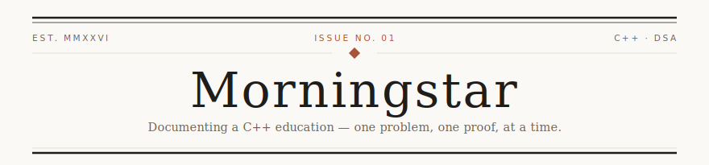
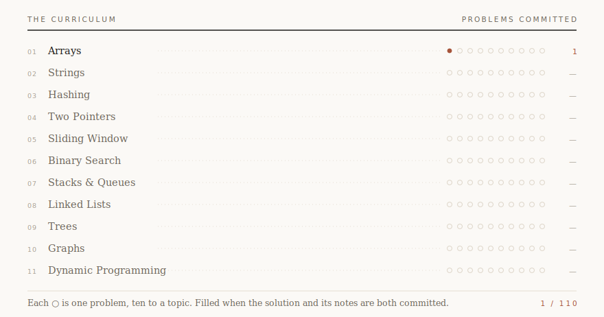
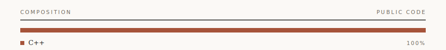

<picture>
  <source media="(prefers-color-scheme: dark)" srcset="./assets/masthead-dark.svg">
  
</picture>

I'm learning C++ the long way round: write the solution, then write down *why* it works.

Everything in the journal below carries the same four things — the approach, the time complexity, the space complexity, and the one thing I didn't know before I started. The code is the easy half. The notes are the half that makes it stick.

Started June 2026. Currently somewhere in the arrays.

---

<picture>
  <source media="(prefers-color-scheme: dark)" srcset="./assets/curriculum-dark.svg">
  
</picture>

---

### In the journal

**[Cpp-DSA-journey](https://github.com/morningstarlv99/Cpp-DSA-journey)** — Modern C++, worked slowly and in public.
Each solution ships with its reasoning attached: problem link, approach, complexity both ways, and what I learned. MIT licensed, and organised by topic rather than by date, because the topic is what you come back looking for.

 

<picture>
  <source media="(prefers-color-scheme: dark)" srcset="./assets/composition-dark.svg">
  
</picture>

<!--
  ── On the stats cards I didn't add ────────────────────────────────────
  The usual profile furniture — total commits, stars, streaks, activity
  graphs — is deliberately absent, for two reasons.

  1. The popular github-readme-stats instance
     (github-readme-stats.vercel.app) is returning 503 DEPLOYMENT_PAUSED
     as of July 2026. Pointing at it renders a broken-image icon. If you
     want those cards, fork the project and self-host your own instance
     rather than trusting the public one; it has a long history of
     rate-limiting and outages.

  2. Even working, they'd currently print "Total Commits: 3 / Stars: 0 /
     PRs: 0". Those cards only ever help when they're bragging. Add them
     once the numbers argue your case — not before.
  ───────────────────────────────────────────────────────────────────────
-->

---

**Colophon** — Set in Georgia. Rules and ornament hand-drawn in SVG; light and dark editions swapped by `prefers-color-scheme`. The curriculum chart is updated by hand, which is the point: it only moves when the work does.
