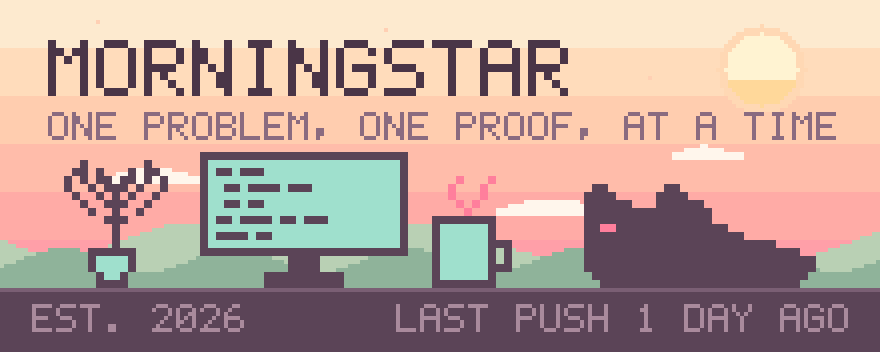
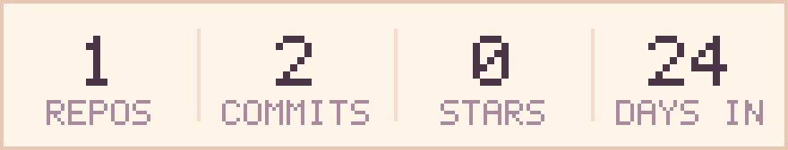
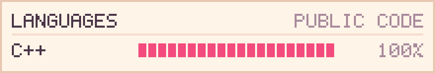
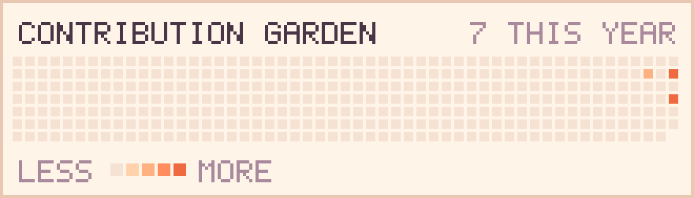
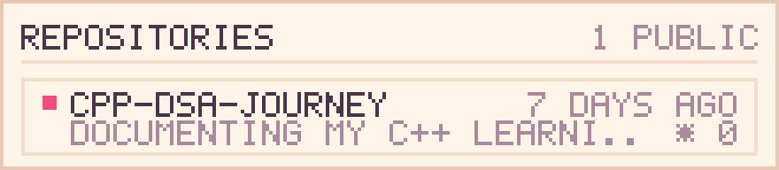

<picture>
  <source media="(prefers-color-scheme: dark)" srcset="./assets/banner-dark.svg">
  
</picture>

I'm learning C++ the long way round: write the solution, then write down *why* it works.

Everything in the journal carries the same four things — the approach, the time complexity, the space complexity, and the one thing I didn't know before I started. The code is the easy half. The notes are the half that makes it stick.

<picture>
  <source media="(prefers-color-scheme: dark)" srcset="./assets/stats-dark.svg">
  
</picture>

<picture>
  <source media="(prefers-color-scheme: dark)" srcset="./assets/languages-dark.svg">
  
</picture>

<picture>
  <source media="(prefers-color-scheme: dark)" srcset="./assets/garden-dark.svg">
  
</picture>

<picture>
  <source media="(prefers-color-scheme: dark)" srcset="./assets/repos-dark.svg">
  
</picture>

### In the journal

**[Cpp-DSA-journey](https://github.com/morningstarlv99/Cpp-DSA-journey)** — Modern C++, worked slowly and in public.
Each solution ships with its reasoning attached: problem link, approach, complexity both ways, and what I learned. MIT licensed, and organised by topic rather than by date, because the topic is what you come back looking for.

---

**Colophon** — Every panel above is pixel art generated by [`scripts/render_profile.py`](scripts/render_profile.py) straight from the GitHub API, then committed by a [daily workflow](.github/workflows/refresh-art.yml). No external card services, no third-party uptime to depend on, no fonts to load: the type is a 5×7 bitmap drawn as rectangles, so it renders identically everywhere. Light and dark editions are swapped by `prefers-color-scheme`. The numbers are whatever the API says they are — the chart moves when the work does, not when I feel like editing it.
